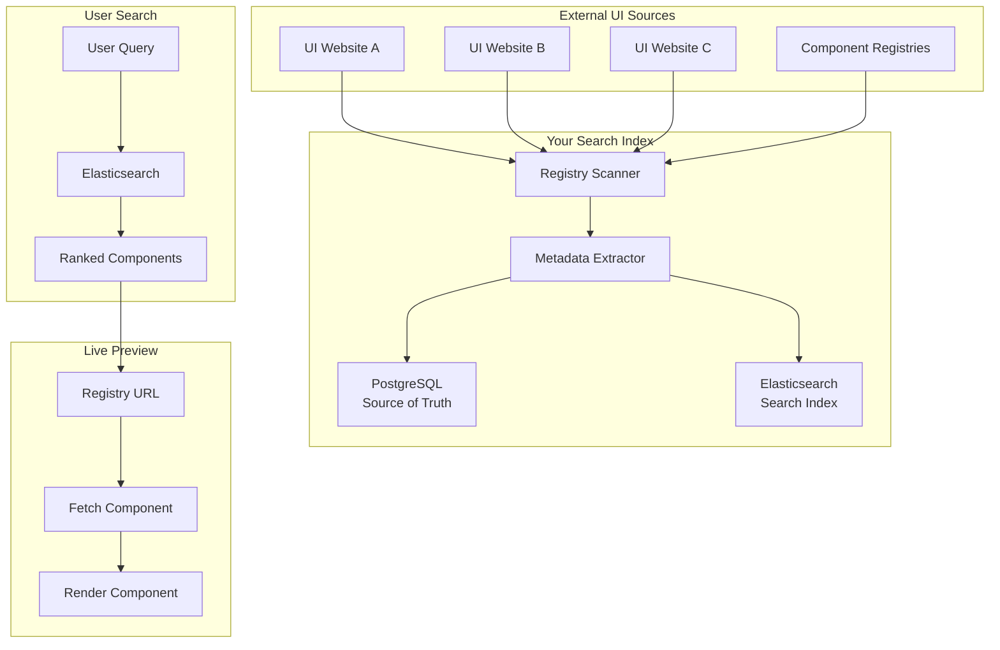
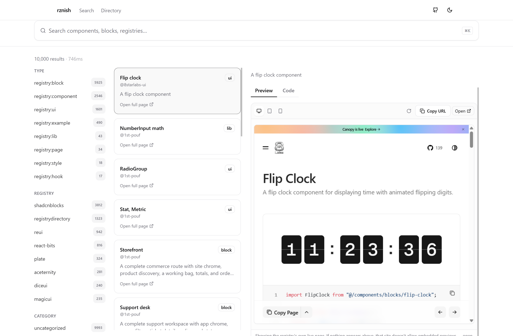
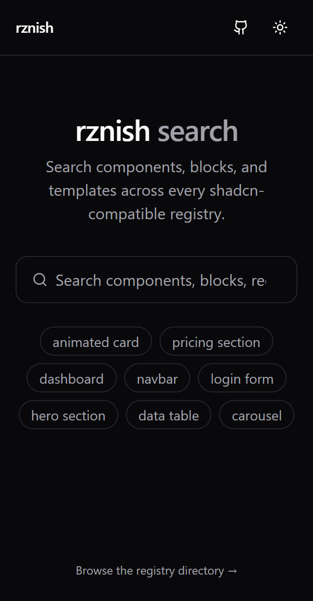
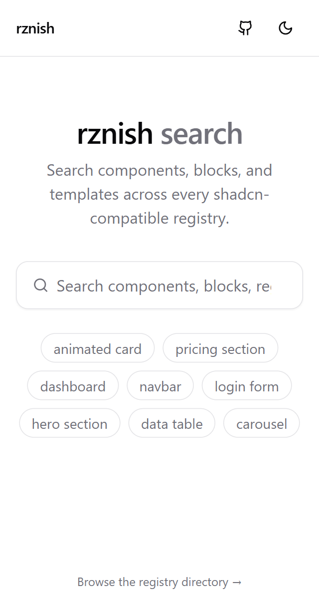
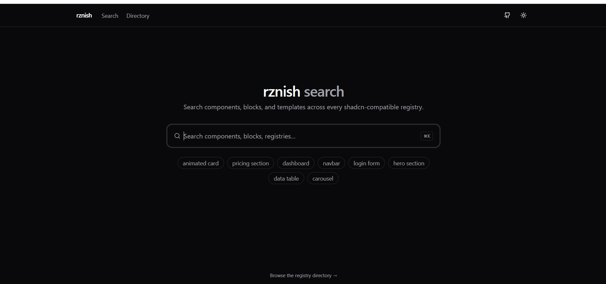

# rznish-search
rznish  search engine  is for ui component , block , etc  

```mermaid
flowchart TD
    subgraph SOURCES["External UI Sources"]
        A1["UI Website A"]
        A2["UI Website B"]
        A3["UI Website C"]
        A4["Component Registries"]
    end

    subgraph INDEX["Your Search Index"]
        B1["Registry Scanner"]
        B2["Metadata Extractor"]
        B3["PostgreSQL<br/>Source of Truth"]
        B4["Elasticsearch<br/>Search Index"]
    end

    subgraph SEARCH["User Search"]
        C1["User Query"]
        C2["Elasticsearch"]
        C3["Ranked Components"]
    end

    subgraph PREVIEW["Live Preview"]
        D1["Registry URL"]
        D2["Fetch Component"]
        D3["Render Component"]
    end

    A1 --> B1
    A2 --> B1
    A3 --> B1
    A4 --> B1

    B1 --> B2
    B2 --> B3
    B2 --> B4

    C1 --> C2
    C2 --> C3
    C3 --> D1
    D1 --> D2
    D2 --> D3
```

    
    

  
  

   

